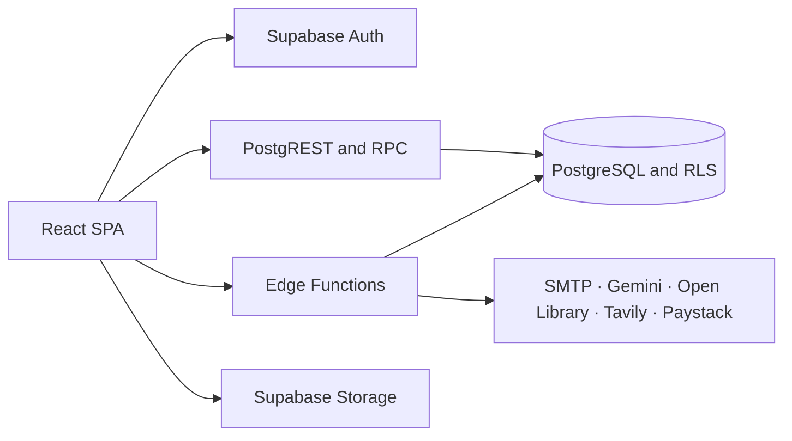

<p align="center">
  <a href="https://wineandchapters.co.za">
    
  </a>
</p>

<p align="center">
  A warm, digital clubhouse for readers to discover books, join events, share reviews, and build community.
</p>

<p align="center">
  <a href="https://wineandchapters.co.za"></a>
  
  
  
  
</p>

## About

Wine & Chapters is the web home of a community-led book club. The public site introduces the club and its current read; signed-in members can take part in the reading room, while administrators manage the community from a protected dashboard.

**Production:** [wineandchapters.co.za](https://wineandchapters.co.za)

## What it includes

- **Public experience:** current reads, an interactive upcoming-events calendar, early review participation, member perspectives, the club story, a Shop preview, contact, and newsletter signup.
- **Member clubhouse:** book suggestions, voting, discussions, reviews, event RSVPs, community activity, and an AI reading companion.
- **Admin workspace:** a responsive sidebar dashboard for member status and protected Auth operations, book and event management, moderation, current-read selection, broadcasts, subscribers, payment settings, and public fallback mode.
- **Structured review publishing:** ratings, book details, reading dates, format, spice/tear levels, feelings, thoughts, quotes, recommendations, spoiler state, and reviewer attribution remain queryable through moderation and publication.
- **Published review journal:** compact spoiler-safe review cards open into keyboard-accessible full details with review metadata, quotes, and member conversation. Member administration uses protected action menus for reset, confirmation, access, and removal workflows.
- **Admin media and moderation:** book-review covers are uploaded to the admin-only `review-images` Storage bucket (external legacy cover URLs still work), and Reading Room posts can be soft-removed or restored without deleting their comments.
- **Book discovery:** Open Library metadata, Tavily-powered current research, and a safe server-side webpage reader.
- **Books AI memory and actions:** owner-isolated Supabase conversations survive refresh/reopen, while a validated tool registry lets Gemini combine persisted context with live club data, book research, safe navigation, themed previews, and member-facing actions.
- **Payments:** administrator-controlled secure online contributions or manual-payment instructions, with server-side checkout and a signed webhook.
- **Branded communication:** verification, recovery, contact, and broadcast email flows.
- **Responsive editorial hero:** the homepage uses dedicated landscape and portrait artwork, an organic staged reveal, restrained depth/scroll motion, and accessible reduced-motion fallbacks. The primary actions lead to registration and the live monthly-read section.
- **About storybook:** the homepage presents a single book cover that opens into a paced, multi-page story. The dedicated About page uses two-column book typography on desktop, single-column mobile text, and video chapters on alternate spreads.
- **Editorial homepage flow:** full-width blush watercolor and quiet paper backgrounds alternate below the unchanged hero, with member perspectives followed by a dedicated “Meet Miss Books” introduction. Its CTA opens the existing Books widget and focuses the message field.
- **Shop preview:** the dedicated `/shop` route presents a minimal coming-soon experience with no placeholder commerce data; joining actions continue to use `/register`.

## Architecture



The React application is deployed as a static site on xneelo. Supabase provides the production database, authentication, row-level authorization, storage, and Edge Functions. The Node service in `backend/src/` remains as migration and reference code; it is not the production API.

## Technology

| Area         | Tools                                                              |
| ------------ | ------------------------------------------------------------------ |
| Frontend     | React 19, TypeScript, Vite, Tailwind CSS                           |
| UI and state | TanStack Router, TanStack Query, Radix UI, shadcn-style components |
| Backend      | Supabase Auth, PostgreSQL, PostgREST, RPC, Storage, Edge Functions |
| Integrations | Gemini, Open Library, Tavily, Paystack, SMTP                       |
| Hosting      | xneelo static hosting and Supabase                                 |

## Repository layout

```text
ui/                         React application
backend/supabase/           Database migrations, config, and Edge Functions
backend/scripts/            Supabase deployment automation
backend/src/                Legacy Node backend reference
functions/                  Legacy Firebase Functions package
docs/                       Architecture and feature documentation
changelog/                  Timestamped implementation notes
```

## Getting started

### Prerequisites

- Node.js 20 or newer
- npm
- A Supabase project for backend development
- Supabase CLI authentication for remote deployments

Install dependencies:

```sh
npm install
```

Create the UI environment file:

```sh
cp ui/.env.example ui/.env
```

Set the public browser configuration in `ui/.env`:

```env
VITE_SUPABASE_URL=https://your-project.supabase.co
VITE_SUPABASE_PUBLISHABLE_KEY=your-project-publishable-key
VITE_ENABLE_DEMO_FALLBACK=false
```

Start the frontend:

```sh
npm run dev:ui
```

Never expose a service-role key, database password, SMTP password, Gemini key, or Paystack secret through a `VITE_*` variable.

### Payment method settings

Administrators can enable or disable online payments, provide a manual-payment message, and switch public routes to the root `fallback.html`. These settings are public-readable only so the browser can select the appropriate state; writes are enforced by Supabase RLS for trusted administrators. Admin and Auth callback routes remain available while fallback mode is on. The checkout Edge Function independently checks the payment setting and fails closed when online payments are disabled. Keep provider secrets, API keys, and passwords out of the manual message.

## Useful commands

| Command                   | Purpose                                             |
| ------------------------- | --------------------------------------------------- |
| `npm run dev:ui`          | Start the frontend development server               |
| `npm run build`           | Create the production UI build                      |
| `npm run deploy:frontend` | Build, validate, and upload the static UI to xneelo |
| `npm run typecheck`       | Type-check the UI and backend                       |
| `npm run lint`            | Lint the UI and backend                             |
| `npm test`                | Run backend tests                                   |
| `npm run build:all`       | Build the UI and legacy Node backend                |
| `npm run deploy:supabase` | Validate and deploy the Supabase backend            |

## Deployment

### Supabase migration notes

Apply pending migrations before deploying the UI. Migration `20260826120000_reviews_members_admin_auth.sql` adds structured review storage, automatic verified-member access, block/removal status, review RLS hardening, admin Auth auditing, and fallback mode. Deploy `admin-members` with the other Edge Functions. See [Review and member admin backend](docs/REVIEW_MEMBER_ADMIN_BACKEND.md) for its request/response contract and rollout checks.

### Frontend

Create `ui/.env.production`, run:

```sh
npm run build
```

Upload the **contents** of `ui/dist/` to the xneelo `public_html` directory. Include the hidden `.htaccess` file so client-side routes resolve correctly.

For the guarded FTP deployment, export `FTP_USER` and `FTP_PASS`, then run this command from any directory inside the repository:

```sh
npm run deploy:frontend
```

The deploy command always resolves `ui/dist` from the script location and refuses to upload unless `index.html`, `.htaccess`, and `assets/` exist. This prevents an incorrect working directory from deleting the live site while mirroring an empty or unrelated build directory. If the domain returns Apache `403 Forbidden`, inspect `public_html` and confirm that `index.html` is at its root—not inside `client/`, `server/`, or `dist/`.

### Supabase backend

The deployment script checks the project link, validates the codebase, pushes migrations and Auth configuration, deploys all Edge Functions, and verifies the remote state:

```sh
npm run deploy:supabase
```

For non-interactive CI/CD:

```sh
SUPABASE_ACCESS_TOKEN=your-token npm run deploy:supabase -- --yes
```

Interactive deployments use the current `supabase login` session. Set `SUPABASE_PROFILE` only when selecting an explicitly named CLI profile.

Edge Function secrets must be configured in Supabase before deployment. Keep local secrets in ignored environment files and never commit them. See the [Supabase backend guide](docs/SUPABASE_BACKEND.md) for the full setup, secret list, webhook configuration, and verification procedure.

### Contact email delivery

The public contact form invokes the `send-email` Edge Function. It stores the contact message and only returns success after SMTP accepts the committee notification and acknowledgement. Configure these Supabase secret names before deployment: `SMTP_HOST`, `SMTP_PORT`, `SMTP_SECURE`, `SMTP_USER`, `SMTP_PASSWORD`, `EMAIL_FROM`, `CONTACT_EMAIL`, `CORS_ORIGIN`, and `PUBLIC_APP_URL`.

Deploy the corrected function to the production project with:

```sh
supabase functions deploy send-email --project-ref ykyzelgoeblxhcdguyww
```

The production UI must use `VITE_SUPABASE_URL=https://ykyzelgoeblxhcdguyww.supabase.co`; this value is present in `ui/.env.example` and should also be set in the production UI environment before rebuilding.

Books uses `TAVILY_API_KEY` only inside `ai-chat` for current web discovery. Open Library search and metadata do not require an API key. The browser receives normalized results and never receives either Gemini or Tavily credentials.

The `ai-chat` function assigns unexpected failures an `errorId`, records structured server-side diagnostics, and stores only safe failure metadata on the persisted user message. Gemini calls have a 20-second timeout and typed rate-limit, authentication, network, malformed-response, and upstream-failure mappings. Prompts, tool arguments, authorization data, API keys, and full provider response bodies are never logged. Retrying with the original request UUID reuses the failed user-message row instead of creating a duplicate.

Gateway JWT verification is intentionally disabled for `ai-chat`; the function still validates the bearer token with Supabase Auth and requires a verified, active application member before it reads conversations or executes tools. This is why the gateway invocation summary can show `auth_user: null` without making the function anonymous.

Its model-facing function declarations use Gemini-compatible schema fields, while tool arguments remain independently validated by the server before execution.

## Documentation

- [Frontend deployment and Apache 403 recovery](docs/FRONTEND_DEPLOYMENT.md)
- [Supabase backend and deployment](docs/SUPABASE_BACKEND.md)
- [UI fixes implementation](docs/UI_FIXES_IMPLEMENTATION.md)
- [Website review updates](docs/WEBSITE_REVIEW_UPDATES.md)
- [Review publishing and admin member backend](docs/REVIEW_MEMBER_ADMIN_BACKEND.md)
- [Homepage, Events, Gallery and Shop UI update](docs/UI_CHANGE_IMPLEMENTATION.md)
- [Homepage backgrounds and Meet Miss Books](docs/HOMEPAGE_BACKGROUNDS_MISS_BOOKS.md)
- [Review submission flow](docs/REVIEW_SUBMISSION.md)
- [Book discovery providers](docs/BOOK_DISCOVERY.md)
- [Reading-room widget](docs/WINE_CHAPTERS_WIDGET.md)
- [Books AI tool and UI action layer](docs/BOOKS_AI_TOOLS.md)
- [Books AI conversation-memory diagnosis](BOOKS_MEMORY_DIAGNOSIS.md)
- [Books chat widget and persistent-memory flow](docs/CHAT_WIDGET.md)
- [Published reviews and member-actions UI](docs/UI_REVIEWS_IMPLEMENTATION.md)
- [Video integration](docs/VIDEO_INTEGRATION.md)

## Security

Authorization is enforced with PostgreSQL row-level security and verified Supabase sessions. Payment webhooks are validated server-side using Paystack's HMAC signature. Treat all browser input as untrusted, keep privileged credentials in Supabase secrets, and review migrations and RLS policies together whenever data access changes.

---

<p align="center"><em>Read deeply. Gather warmly. Share generously.</em></p>
